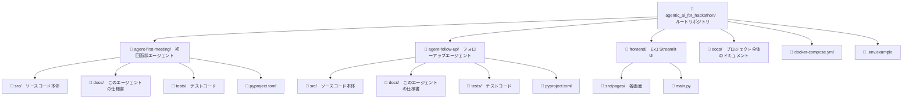
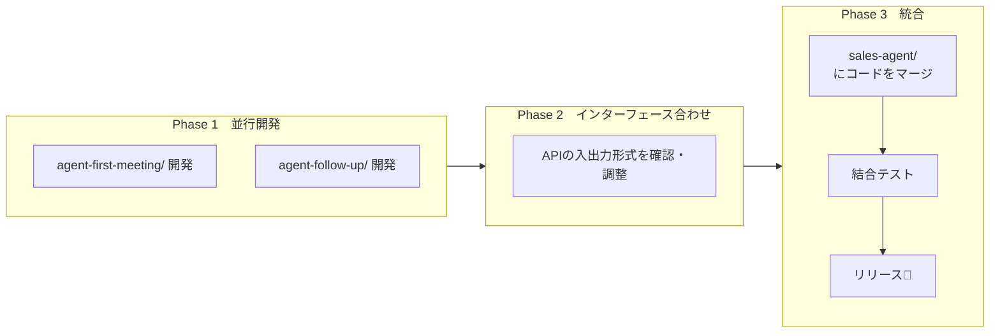
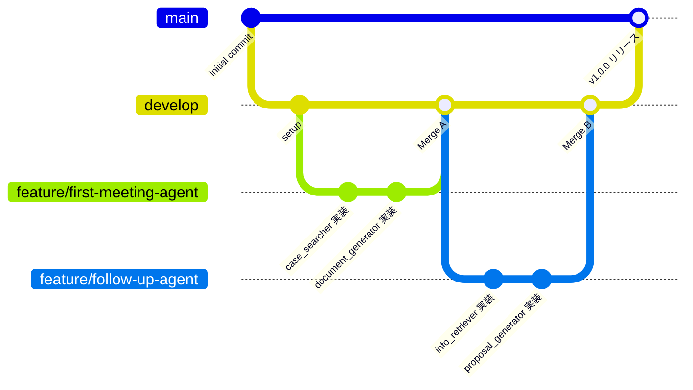
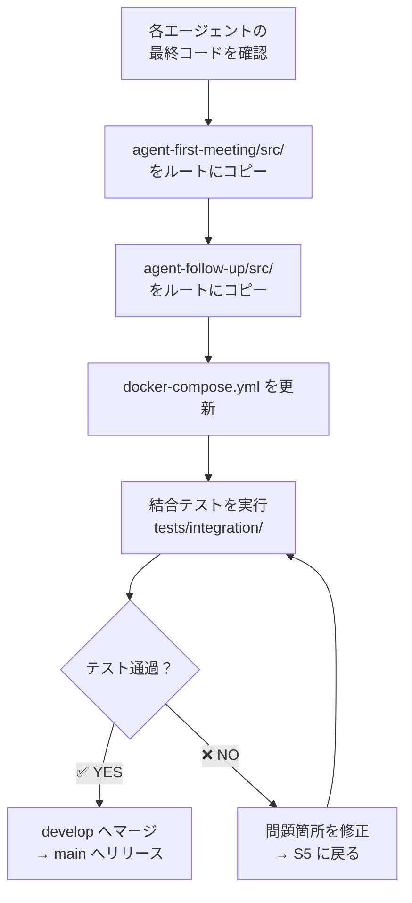

# agentic_ai_for_hackathon

## プロジェクト名：営業支援エージェント

営業担当者の日次業務をサポートするAIエージェントシステムです。<br>
初回面談向けのアポ資料生成と、2回目以降の提案資料生成を自動化します。

---
 
## 目次
 
- [システム概要](#システム概要)
- [リポジトリ構成](#リポジトリ構成)
- [開発フロー](#開発フロー)
- [ブランチ運用](#ブランチ運用)
- [環境構築](#環境構築)
- [統合手順](#統合手順)
- [ドキュメント管理ルール](#ドキュメント管理ルール)

---

## システム概要


 
| 色 | 担当 |
|---|---|
| 🟣 紫 | AIエージェントが自動処理 |
| 🔵 青 | 営業担当者がアクション |
| ⚫ グレー | 共通処理 |
 
---


## リポジトリ構成
 
ルートリポジトリ配下に、**エージェント単位・アプリ単位**でディレクトリを分けて管理します。
 


### 各ディレクトリの役割
 
| ディレクトリ | 担当者 | 役割 |
|---|---|---|
| `agent-first-meeting/` | ともや | 初回面談向け：類似事例検索・アポ資料生成 |
| `agent-follow-up/` | 未定 | 2回目以降：顧客情報参照・提案資料生成 |
| `frontend/` | 未定 | Streamlit による営業担当者向けUI |
| `docs/` | 共同 | システム全体のドキュメント |

### `src/` と `docs/` の使い分け
 
```
各エージェントディレクトリ/
├── src/       # 動くコード本体（Pythonがimportする）
│              # agent/, api/, models/, core/ などを格納
└── docs/      # そのエージェント専用の説明書
               # api.md, overview.md, prompts.md などを格納
```

> **ポイント**：`docs/` は各エージェント内と、ルート直下の2か所に存在します。
> - 各エージェント内の `docs/` → その機能の詳細仕様
> - ルート直下の `docs/` → プロジェクト全体の概要・統合仕様

---
 
## 開発フロー
 
2人が**並行して**それぞれのエージェントを開発し、最終的にルートリポジトリへ統合します。
 


## 統合をスムーズにするための事前合意事項
 
開発開始前に決めておくべきこと。
 
| 項目 | 内容例 |
|---|---|
| Pythonバージョン | `3.11` に統一 |
| レスポンスのJSON形式 | 下記サンプル参照 |
| エラーの返し方 | `{"status": "error", "message": "..."}` |
| 環境変数の名前 | `ANTHROPIC_API_KEY`, `DATABASE_URL` etc... |
| コードフォーマッター | `ruff` を使用 |
 
**共通レスポンス形式（サンプル）**
 
```json
{
  "status": "success",
  "data": {
    "document_url": "https://...",
    "generated_at": "2026-05-07T10:00:00"
  },
  "error": null
}
```
 
---

## ブランチ運用（想定）
 


### ブランチ命名規則

| 種類 | 命名規則 | 例 |
|---|---|---|
| 機能追加 | `feature/機能名` | `feature/case-searcher` |
| バグ修正 | `fix/内容` | `fix/document-generator-bug` |
| 緊急修正 | `hotfix/内容` | `hotfix/api-key-error` |

### PR (Pull / Request) のルール

- `main` への直接pushは禁止
- `develop` へのマージは必ずPRを経由する
- PR には概要・変更内容・動作確認結果を記載する

---

## 環境構築

### 前提条件

- Python 3.11 以上
- Docker / Docker Compose

### セットアップ手順

```bash
# 1. 環境変数を設定（仮）
cp .env.example .env
# .env を開いてAPIキー等を入力
 
# 2. 各エージェントの仮想環境を作成・依存インストール
cd agent-first-meeting
python -m venv .venv
source .venv/bin/activate   
pip install -e ".[dev]"
cd ..
 
cd agent-follow-up
python -m venv .venv
source .venv/bin/activate
pip install -e ".[dev]"
cd ..
 
# 4. Dockerで全体起動（統合時）
docker-compose up --build
```

### 環境変数一覧
 
| 変数名 | 説明 | 必須 |
|---|---|---|
| `***_API_KEY` | Model APIキー | ✅ |
| `FIRST_MEETING_API_URL` | 初回エージェントのURL | ✅ |
| `FOLLOW_UP_API_URL` | フォローアップエージェントのURL | ✅ |
 
> ⚠️ `.env` は絶対にGitにコミットしないでください。`.env.example`（ダミー値入り）のみをGitで管理します。
 
---
 
## 統合手順

Phase 3（統合時）の具体的な作業手順です。
 


---
 
## ドキュメント管理ルール（仮）
 
| ドキュメント | 場所 | 記載内容 |
|---|---|---|
| プロジェクト概要 | `docs/overview.md` | システム全体の目的・構成 |
| API仕様（全体） | `docs/api.md` | 全エンドポイントの一覧 |
| 環境構築手順 | `docs/setup.md` | 詳細なセットアップ手順 |
| 初回エージェント仕様 | `agent-first-meeting/docs/api.md` | エンドポイント・入出力定義 |
| フォローアップ仕様 | `agent-follow-up/docs/api.md` | エンドポイント・入出力定義 |

### `docs/api.md` の書き方テンプレート（仮）
 
各エージェントの `docs/api.md` は以下の形式で記載してください。
 
```markdown
## POST /api/first-meeting/generate
 
### リクエスト
{
  "company_name": "株式会社〇〇",
  "industry": "製造業",
  "scale": "中小企業"
}
 
### レスポンス
{
  "status": "success",
  "data": {
    "document_url": "https://...",
    "generated_at": "2026-05-07T10:00:00"
  }
}
```