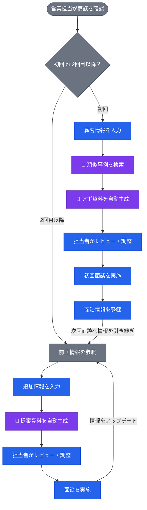
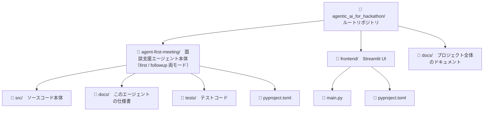
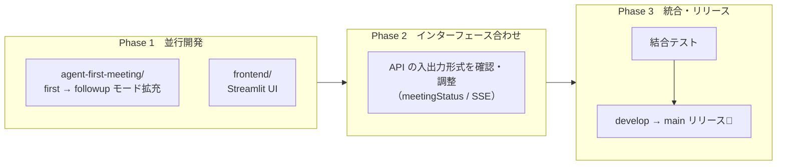
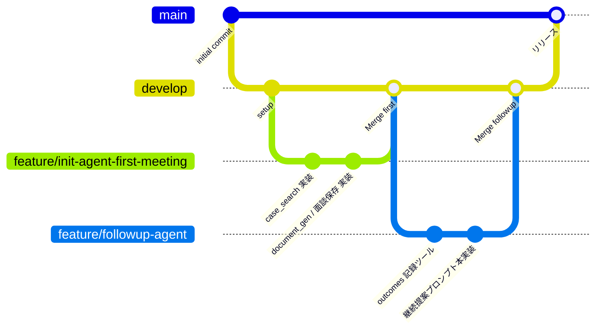
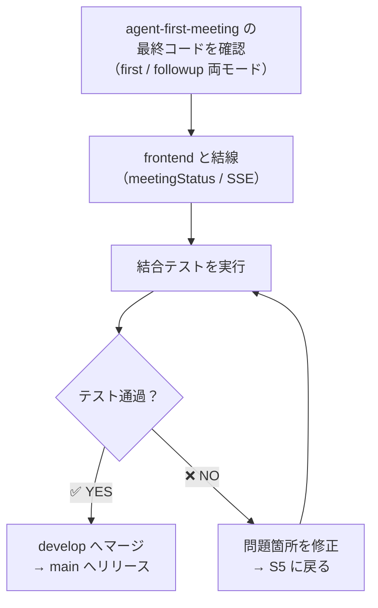

# agentic_ai_for_hackathon

## プロジェクト名：営業支援エージェント

営業担当者の日次業務をサポートするAIエージェントシステムです。<br>
初回面談向けのアポ資料生成と、2回目以降の提案資料生成を自動化します。

---
 
## 目次
 
- [システム概要](#システム概要)
- [リポジトリ構成](#リポジトリ構成)
- [開発フロー](#開発フロー)
- [ブランチ運用](#ブランチ運用)
- [環境構築](#環境構築)
- [統合手順](#統合手順)
- [ドキュメント管理ルール](#ドキュメント管理ルール)

---

## システム概要


 
| 色 | 担当 |
|---|---|
| 🟣 紫 | AIエージェントが自動処理 |
| 🔵 青 | 営業担当者がアクション |
| ⚫ グレー | 共通処理 |
 
---


## リポジトリ構成
 
ルートリポジトリ配下に、**エージェント単位・アプリ単位**でディレクトリを分けて管理します。
 


### 各ディレクトリの役割
 
| ディレクトリ | 担当者 | 役割 |
|---|---|---|
| `agent-first-meeting/` | ともや | 面談支援エージェント本体。**初回（first）と 2回目以降（followup）の両モードに対応**し、`meetingStatus` で切り替える（類似事例検索・資料生成・面談履歴の参照／記録） |
| `frontend/` | 未定 | Streamlit による営業担当者向けUI |
| `docs/` | 共同 | システム全体のドキュメント |

> 当初は 2回目以降を別ディレクトリ `agent-follow-up/` に分ける構想だったが、利用ツールが
> ほぼ共通のため、`agent-first-meeting/` 内に followup モードとして統合した。

### `src/` と `docs/` の使い分け
 
```
各エージェントディレクトリ/
├── src/       # 動くコード本体（Pythonがimportする）
│              # agent/, api/, models/, core/ などを格納
└── docs/      # そのエージェント専用の説明書
               # api.md, overview.md, prompts.md などを格納
```

> **ポイント**：`docs/` は各エージェント内と、ルート直下の2か所に存在します。
> - 各エージェント内の `docs/` → その機能の詳細仕様
> - ルート直下の `docs/` → プロジェクト全体の概要・統合仕様

---
 
## 開発フロー
 
エージェント本体（first → followup の順でモードを拡充）と UI を**並行して**開発し、
`develop` へ集約して `main` にリリースします。



## 統合をスムーズにするための事前合意事項
 
開発開始前に決めておくべきこと。
 
| 項目 | 内容例 |
|---|---|
| Pythonバージョン | `3.11` に統一 |
| レスポンスのJSON形式 | 下記サンプル参照 |
| エラーの返し方 | `{"status": "error", "message": "..."}` |
| 環境変数の名前 | `ANTHROPIC_API_KEY`, `DATABASE_URL` etc... |
| コードフォーマッター | `ruff` を使用 |
 
**共通レスポンス形式（サンプル）**
 
```json
{
  "status": "success",
  "data": {
    "document_url": "https://...",
    "generated_at": "2026-05-07T10:00:00"
  },
  "error": null
}
```
 
---

## ブランチ運用（想定）
 


### ブランチ命名規則

| 種類 | 命名規則 | 例 |
|---|---|---|
| 機能追加 | `feature/機能名` | `feature/case-searcher` |
| バグ修正 | `fix/内容` | `fix/document-generator-bug` |
| 緊急修正 | `hotfix/内容` | `hotfix/api-key-error` |

### PR (Pull / Request) のルール

- `main` への直接pushは禁止
- `develop` へのマージは必ずPRを経由する
- PR には概要・変更内容・動作確認結果を記載する

---

## 環境構築

### 前提条件

- **Python 3.12** 動作確認済み（3.11 以上であれば動く想定）
- [Azure CLI](https://learn.microsoft.com/cli/azure/install-azure-cli) (`az`) v2.60+ ＋ 有効な Azure サブスクリプション
- （統合フェーズで使用）Docker / Docker Compose

### セットアップ手順

```powershell
# 1. Azure リソースを Azure CLI で一括構築
#    詳細は agent-first-meeting/docs/azure_setup.md を参照
az login
# ↑ ガイドの「0. 準備」→「4. Blob Storage」までを順にコピペ実行
#   Foundry / Cosmos DB（vector search 込み）/ Blob Storage が立ち上がる

# 2. .env を作成（ガイドの「5. .env への反映」で値を流し込む）
cp agent-first-meeting/.env.example agent-first-meeting/.env
# Azure CLI で取得した値をエディタで貼り付け

# 3. agent-first-meeting の仮想環境＋依存インストール
cd agent-first-meeting
python -m venv .venv
.\.venv\Scripts\Activate.ps1     # macOS/Linux: source .venv/bin/activate
pip install -e ".[dev]"

# 4. Azure リソースへのスモークテスト＆シードデータ投入
python scripts/check_foundry.py        # Foundry 疎通
python scripts/ingest_documents.py     # data/ の PPTX を documents/chunks へ取り込み（chunks も自動作成）
python scripts/seed_customer.py        # customers / meetings へ投入
python scripts/check_vector_search.py  # vector 検索の動作確認
python scripts/check_pptx_blob.py      # Blob アップロードの動作確認

# 5. API サーバー起動
python scripts/run_server.py           # http://127.0.0.1:8000

# 6. 別ターミナルで Streamlit フロントエンドを起動
cd ../frontend
python -m venv .venv
.\.venv\Scripts\Activate.ps1
pip install -e .
streamlit run main.py                  # http://localhost:8501
```

> 📘 Azure リソースの作成（`az group create` から `az role assignment create` まで）は **[agent-first-meeting/docs/azure_setup.md](agent-first-meeting/docs/azure_setup.md)** にコピペ可能な PowerShell コマンドで一式まとめてあります。

### 環境変数一覧

`.env` の全項目とその取得方法は [agent-first-meeting/docs/azure_setup.md §5](agent-first-meeting/docs/azure_setup.md#5-env-への反映) を参照。主なキーは以下：

| 変数名 | 説明 | 必須 |
|---|---|---|
| `AZURE_OPENAI_ENDPOINT` / `AZURE_OPENAI_API_KEY` | Foundry (Azure OpenAI) | ✅ |
| `AZURE_OPENAI_CHAT_DEPLOYMENT` | チャットモデルのデプロイ名（推奨 `gpt-4o`。`gpt-4.1` のクオータがあれば可） | ✅ |
| `AZURE_OPENAI_EMBEDDING_DEPLOYMENT` | 埋め込みモデルのデプロイ名（既定 `text-embedding-3-large`） | ✅ |
| `COSMOS_ENDPOINT` / `COSMOS_KEY` | Cosmos DB 接続情報 | ✅ |
| `COSMOS_DATABASE` | データベース名（既定 `sales-agent`） | ✅ |
| `BLOB_ACCOUNT_URL` / `BLOB_CONTAINER` | 生成 pptx の保存先 | ✅ |
| `BLOB_ACCOUNT_KEY` | SAS 付きダウンロード URL を発行したい場合のみ | 任意 |
| `FIRST_MEETING_API_URL` | フロントエンドが叩く API URL（既定 `http://127.0.0.1:8000/api/first-meeting/generate`） | 任意 |

> ⚠️ `.env` は絶対にGitにコミットしないでください。`.env.example`（ダミー値入り）のみをGitで管理します。

### 後片付け

ハッカソン終了後はリソースグループごと削除すれば課金が止まります：

```powershell
# azure_setup.md §0-3 で定義した $RG をそのまま使う
az group delete --name $RG --yes --no-wait
```
 
---
 
## 統合手順

Phase 3（統合時）の具体的な作業手順です。
 


---
 
## ドキュメント管理ルール（仮）
 
| ドキュメント | 場所 | 記載内容 |
|---|---|---|
| プロジェクト概要 | `docs/overview.md` | システム全体の目的・構成 |
| API仕様（全体） | `docs/api.md` | 全エンドポイントの一覧 |
| 環境構築手順 | `docs/setup.md` | 詳細なセットアップ手順 |
| 面談エージェント仕様（first / followup） | `agent-first-meeting/docs/api.md` | エンドポイント・入出力定義（両モード） |

### `docs/api.md` の書き方テンプレート（仮）
 
各エージェントの `docs/api.md` は以下の形式で記載してください。
 
```markdown
## POST /api/first-meeting/generate
 
### リクエスト
{
  "company_name": "株式会社〇〇",
  "industry": "製造業",
  "scale": "中小企業"
}
 
### レスポンス
{
  "status": "success",
  "data": {
    "document_url": "https://...",
    "generated_at": "2026-05-07T10:00:00"
  }
}
```