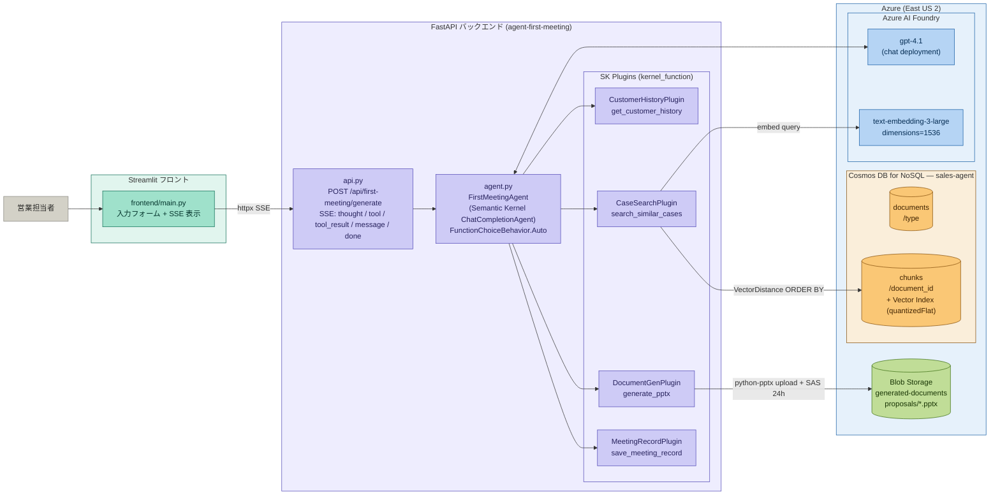
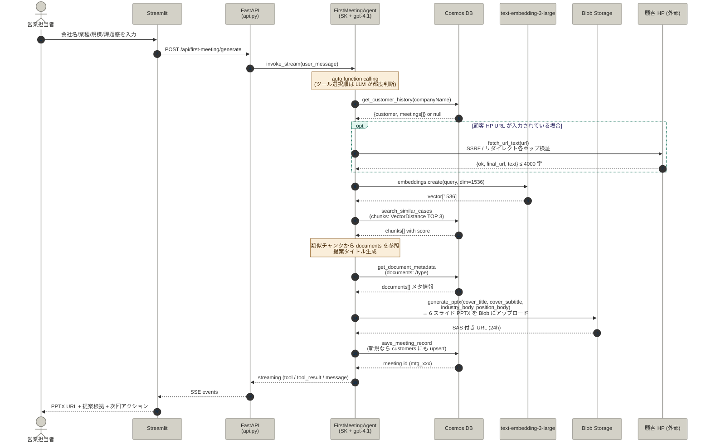
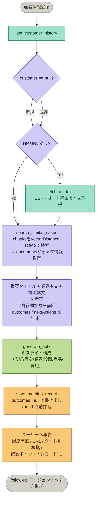

# agent-first-meeting

初回面談向け：類似事例検索・アポ資料生成エージェント

## 概要

営業担当者が顧客情報を入力すると、社内に蓄積された類似事例を検索し、初回アポ資料（PowerPoint）を自動生成します。

- **エージェント基盤**: Azure AI Foundry + Semantic Kernel（Python, single-agent, auto function calling）
- **LLM**: GPT-4.1（Azure OpenAI on Foundry にデプロイ）
- **埋め込みモデル**: text-embedding-3-large
- **データストア**: Azure Cosmos DB（顧客・面談・事例 + Vector Search）
- **資料生成**: python-pptx（6 スライド構成：表紙 / 目次 / 業界向け / 役職向け / 自社商品 / 費用）
- **出力ストレージ**: Azure Blob Storage
- **デプロイ先**: Azure Container Apps

## システム構成図



## 実行フロー



## エージェントの判断ロジック

> 以下は **標準フロー（システムプロンプトで指示している期待動作）**。
> 実際のツール呼び出し順・回数は `FunctionChoiceBehavior.Auto` により LLM が毎ターン判断する。
> たとえば HP URL が未入力なら `fetch_url_text` はスキップされる。



## ディレクトリ構成

```tree
agent-first-meeting/
├── pyproject.toml
├── README.md
├── .env.example
├── src/
│   └── agent_first_meeting/    # Python パッケージ本体
├── tests/                      # テストコード
└── docs/                       # このエージェントの仕様書
```

## セットアップ

### 0. Azure リソースの準備

Foundry / Cosmos DB / Blob Storage を Azure 上に作成します。手順は [docs/azure_setup.md](docs/azure_setup.md) を参照。

### 1. ローカル環境

```bash
# 仮想環境を作成
python -m venv .venv
source .venv/bin/activate   # Windows: .venv\Scripts\activate

# 依存をインストール（開発用）
pip install -e ".[dev]"

# 環境変数を設定
cp .env.example .env
# .env を開いて Azure リソースの接続情報を記入
```

## エージェントのツール構成

エージェントは以下の Semantic Kernel プラグインを `FunctionChoiceBehavior.Auto` で自律的に呼び出します。

| # | ツール名 | プラグイン | 役割 |
|:--|:--|:--|:--|
| ① | `get_customer_history` | `CustomerHistoryPlugin` | 過去の顧客情報・面談履歴を取得 |
| ② | `search_similar_cases` | `CaseSearchPlugin` | `chunks` をベクトル検索（TOP N, quantizedFlat）→ `documents` からメタ情報取得|
| ③ | `fetch_url_text` | `WebFetchPlugin` | 顧客 HP の URL を取得し本文テキスト化（最大4000字） |
| ④ | `generate_pptx` | `DocumentGenPlugin` | 6 スライド PPTX 生成 → Blob アップロード（SAS 24h） |
| ⑤ | `save_meeting_record` | `MeetingRecordPlugin` | 面談記録を保存（follow-up エージェントへの引き継ぎ） |

### 各ツールの解析

1. `get_customer_history`
    - 過去に面談したことがある顧客かどうかを確認する。
    - 既存顧客であれば前回の提案内容や結果を取得し、今回の提案に活かす。
2. `search_similar_cases`
   - 顧客の業種・規模・課題を元に類似事例を検索する。
   - `chunks` コンテナでベクトル検索を行い、ヒットしたチャンクの元資料情報を `documents` コンテナから取得する。
    > 図書館で「この本に似た本を探して」と頼むと、まず本文の内容で類似本を見つけ（`chunks` 検索）、
    > 次にその本のタイトルや著者を確認する（`documents` 参照）イメージです。
3. `fetch_url_text`
   - 顧客のHPを取得してテキスト化する。
   - 事前に顧客のことを調べた上で提案できるため、より的確な資料を作成できる。
   - HP の URL が未入力の場合はスキップされる。
4. `generate_pptx`
   - 収集した情報を元に提案資料（PPTX）を自動生成する。
   - Blob Storage にアップロードする。
   - 発行された URL は24時間有効。
5. `save_meeting_record`
    - 生成した提案内容を面談記録として保存。
    - follow-up エージェントが次回以降の対応を引き継げる用ににするための記録。

## テスト

純粋ロジック（PPTX 組み立て / スキーマ / HTML→テキスト変換）は Azure / Semantic Kernel に依存せず単独で実行できます。

```bash
# 依存をインストール（一度だけ）
pip install -e ".[dev]"

# テスト実行
pytest tests/ -v
```

| テストファイル | 対象 | 依存 |
|---|---|---|
| `tests/test_pptx_builder.py` | `_pptx_builder.build_presentation_bytes` の 6 スライド構造 | `python-pptx` のみ |
| `tests/test_schemas.py` | `GenerateRequest` バリデーション / `to_user_message` 整形 | `pydantic` のみ |
| `tests/test_html_to_text.py` | `_html_to_text.strip_html` の HTML 整形 | `beautifulsoup4` のみ |
| `tests/test_url_safety.py` | `_url_safety.is_safe_public_url` の SSRF ガード | 標準ライブラリのみ |
| `tests/test_web_fetch.py` | `_web_fetch_helpers` のストリーミング/Content-Type ガード | `httpx` のみ |
| `tests/test_role_classifier.py` | 役職カテゴリ分類 | 標準ライブラリのみ |
| `tests/test_meeting_id.py` | `_company_id` の決定的 ID 生成 | 標準ライブラリのみ |

## API

```
POST /api/first-meeting/generate
Content-Type: application/json
Accept: text/event-stream

Request:
{
  "companyName": "株式会社サンプル",
  "industry": "製造業",
  "scale": "中小企業",
  "knownInfo": "DX推進したいが何から手を付けるか不明",
  "salesperson": "佐々木"
}
```

詳細は [docs/api.md](docs/api.md) を参照。
