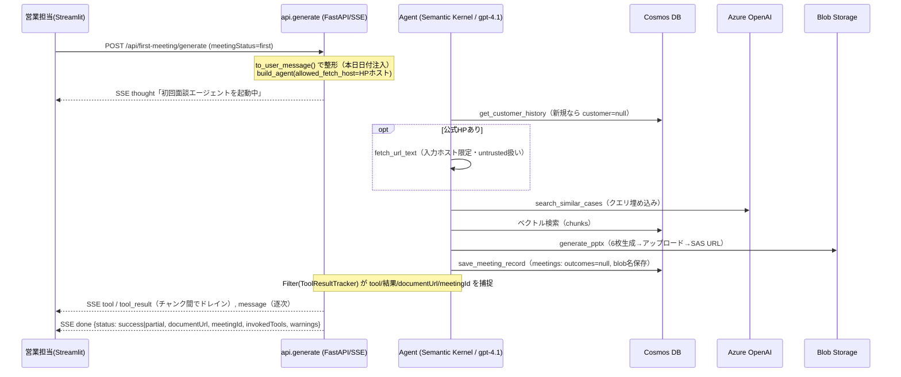
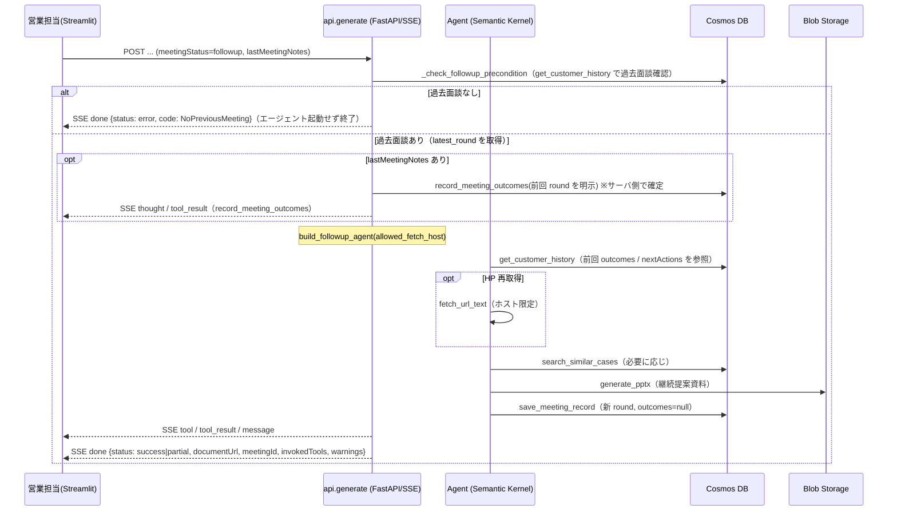

# 動作フロー（初回 / 2回目以降）

`POST /api/first-meeting/generate` は単一の窓口で、`meetingStatus`（`first` / `followup`）
によって振る舞いを切り替える。応答は SSE（Server-Sent Events）でストリーミングされる。
ここでは**どのファイル・ツールが何を読み書きするか**を実装に沿って示す。

## 関係するファイルと役割

| ファイル | 役割 |
|---|---|
| `frontend/main.py` | Streamlit UI。アクセスコード・ゲート → 入力フォーム → API を SSE 呼び出し、進捗とDLボタンを表示。連続実行クールダウン。 |
| `src/agent_first_meeting/api.py` `generate()` | first/followup 分岐、followup の前提チェック、**前回 outcomes のサーバ側記録**、SSE 配信、`status` 判定（success/partial/error） |
| `src/agent_first_meeting/schemas.py` `to_user_message()` | リクエストを LLM 向けプロンプトに整形（役職カテゴリの前処理・本日日付の注入） |
| `src/agent_first_meeting/agent.py` | `build_agent` / `build_followup_agent`、instructions、ツール呼び出しを捕捉する Filter `ToolResultTracker` |
| `tools/customer_history.py` | Cosmos `customers` / `meetings` 読込。履歴中の資料URLを**読み出し時に SAS 再署名** |
| `tools/case_search.py` | OpenAI 埋め込み + Cosmos `chunks` のベクトル検索（業種は双方向 CONTAINS + 全業種を常時対象） |
| `tools/web_fetch.py` | 顧客 HP 取得。**入力された顧客HPのホストに限定** + SSRF ガード + 「信頼できない外部データ」明示 |
| `tools/document_gen.py` | python-pptx で6スライド生成 → Blob アップロード → SAS 付きURL（永続保存は blob 名） |
| `tools/meeting_record.py` | `save_meeting_record`（新規 round, `outcomes=null`, blob 名保存）/ `record_meeting_outcomes`（前回 round を確定） |
| `_azure_clients.py` / `tools/_blob_sas.py` | Cosmos / OpenAI / Blob クライアント生成（キー or Managed Identity）、SAS 発行 |

## 初回（first）

- 必須ツール（`REQUIRED_TOOLS_FIRST`）: `generate_pptx`, `save_meeting_record`。
- 資料は出たが必須ツールが欠けた場合は `status=partial`（警告付き）。資料が無ければ `error`（`NoDocument`）。

## 2回目以降（followup）

**初回との決定的な違い**:
- 前提チェックで過去面談が無ければ即エラー（`NoPreviousMeeting`）。
- 前回実績（outcomes）の記録は **API（サーバ側）が前回 round を明示して確定**する（LLM の呼び出し順に依存しない）。エージェント自身は `record_meeting_outcomes` を呼ばない。
- 必須ツール（`REQUIRED_TOOLS_FOLLOWUP`）: `get_customer_history`, `generate_pptx`, `save_meeting_record`。

## データの読み書き（まとめ）

- **読み取り**: `customers` / `meetings`（履歴）、`documents` / `chunks`（類似事例ベクトル検索）、外部HP（任意・ホスト限定）。
- **書き込み**: Blob `generated-documents/proposals/*.pptx`、`customers`（決定的 companyId で upsert）、`meetings`（`mtg_{companyId}_{round:04d}`、409 リトライ採番。初回・followup とも `outcomes=null` で作成し、次回の followup 時にサーバ側で前回 round へ確定）。
- **返却**: 24時間有効の SAS 付きダウンロードURL（永続データには blob 名のみ保存し、履歴読み出し時に都度再署名）。
