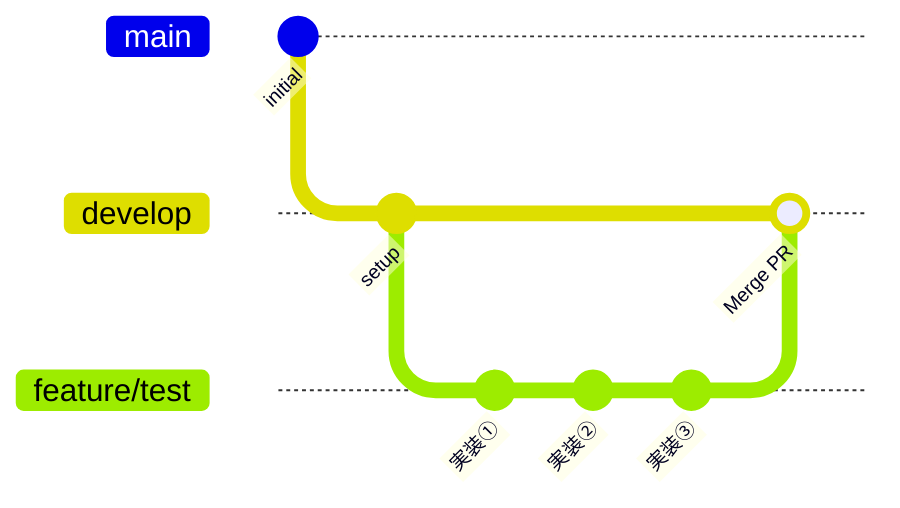
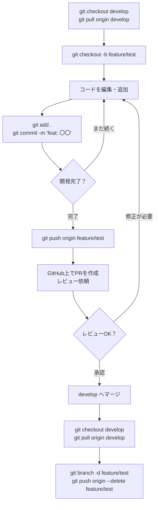

# Git 運用ガイド

feature ブランチで開発し、develop ブランチへマージするまでの手順をまとめたドキュメントです。

---

## 全体の流れ



---

## ステップごとのコマンド

### Step 1：feature ブランチを作る

```bash
# まず develop ブランチを最新にする
git checkout develop
git pull origin develop

# feature ブランチを作って移動
git checkout -b feature/test
```

> `git checkout -b` は「ブランチを作る」＋「そこに移動する」を同時に行うコマンドです。

---

### Step 2：開発する（ここを繰り返す）

```bash
# 変更内容を確認
git status
git diff

# ステージングに追加（コミットする対象を選ぶ）
git add src/agent/case_searcher.py
# または全ファイルまとめて追加
git add .

# コミット（変更内容を記録）
git commit -m "feat: 類似事例検索の基本実装を追加"
```

#### コミットメッセージの書き方

| 種類 | プレフィックス | 例 |
|---|---|---|
| 機能追加 | `feat:` | `feat: 類似事例検索を実装` |
| バグ修正 | `fix:` | `fix: 検索結果が空になるバグを修正` |
| ドキュメント | `docs:` | `docs: api.md にエンドポイントを追記` |
| リファクタ | `refactor:` | `refactor: case_searcher を整理` |

---

### Step 3：GitHub に push する

```bash
# feature ブランチをリモート（GitHub）に送る
git push origin feature/test
```

---

### Step 4：Pull Request（PR）を作る

push したら GitHub 上で PR を作成します。

```
base: develop  ←  compare: feature/test
```

PR には以下を記載してください。

- 何を実装・修正したか
- 動作確認した内容
- レビューしてほしいポイント（あれば）

---

### Step 5：レビュー・マージ後に後片付け

PR がマージされたら、ローカルも整理します。

```bash
# develop に戻って最新を取得
git checkout develop
git pull origin develop

# 使い終わった feature ブランチをローカルから削除
git branch -d feature/test

# リモートの feature ブランチも削除
git push origin --delete feature/test
```

---

## よくある場面への対処

### 開発中に develop が更新されたとき

チームメンバーが develop にマージした場合、自分のブランチに取り込みます。

```bash
# 自分の feature ブランチにいる状態で
git fetch origin
git merge origin/develop

# コンフリクト（競合）が出たら手動で修正してから
git add .
git commit -m "merge: develop の変更を取り込み"
```

### コミット前に変更を一時退避したいとき

```bash
# 変更を一時的に退避
git stash

# 別の作業を終えたら戻す
git stash pop
```

---

## 一連の流れまとめ



---

## ブランチ命名規則

| 種類 | 命名規則 | 例 |
|---|---|---|
| 機能追加 | `feature/機能名` | `feature/case-searcher` |
| バグ修正 | `fix/内容` | `fix/document-generator-bug` |
| 緊急修正 | `hotfix/内容` | `hotfix/api-key-error` |

---

## 注意事項

- `main` および `develop` への直接 push は禁止です。必ず feature ブランチ経由で PR を出してください。
- コミットは「1つの機能・1つの修正ごと」を意識してください。後から履歴を見返したときにわかりやすくなります。
- PR のマージは必ずもう1人がレビューしてから行ってください。