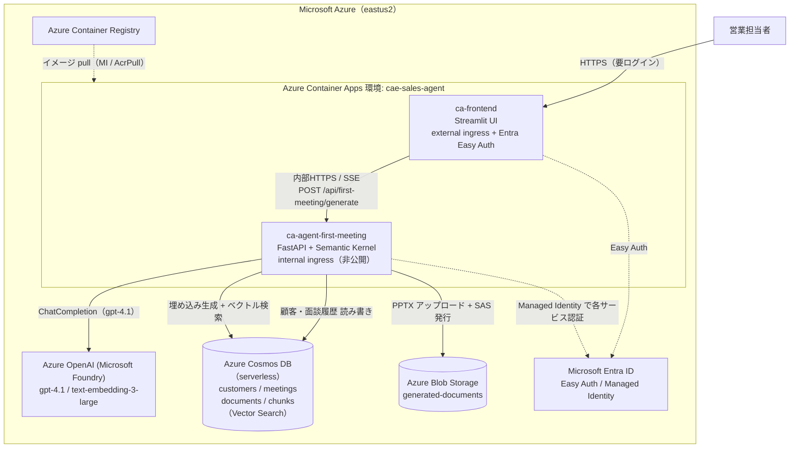
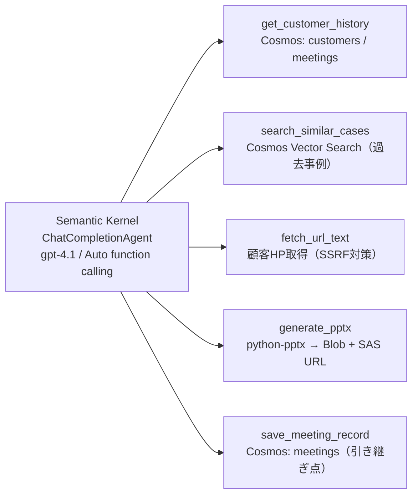
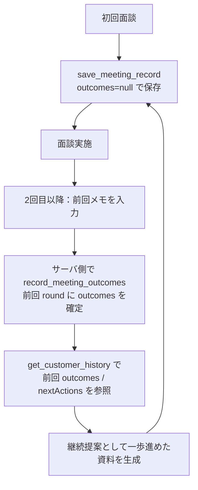

# アーキテクチャ図（Microsoft Agent Hackathon 提出用）

> Zenn は mermaid コードブロックをそのまま図として描画します。以下をそのまま記事に貼れば「アーキテクチャ図の埋め込み」要件を満たせます。

## 1. システム全体（デプロイ / データフロー）

## 2. エージェント内部（Semantic Kernel + ツール群）

## 3. 「初回 → 2回目以降」のデータ引き継ぎ

## コンポーネントと採用技術（ハッカソン要件との対応）

| レイヤ | 採用技術 | ハッカソン要件 |
|---|---|---|
| 実行基盤 | **Azure Container Apps**（API / フロント） | 【必須】Azure 実行基盤 ✅ |
| 生成AI / エージェント | **Azure OpenAI(Foundry) gpt-4.1 + Semantic Kernel** | 【必須】Microsoft AI 技術 ✅ |
| データ × AI（RAG） | **Azure Cosmos DB Vector Search**（1536次元） | 【推奨】Cosmos DB 申告 ✅ |
| 認証 | **Microsoft Entra ID**（Easy Auth + Managed Identity） | 【推奨】Entra ID 申告 ✅ |
| ストレージ | Azure Blob Storage（生成PPTX） | — |
| レジストリ | Azure Container Registry | — |
