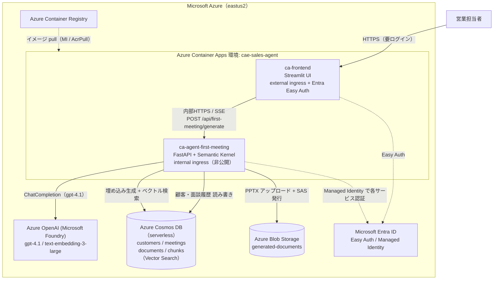
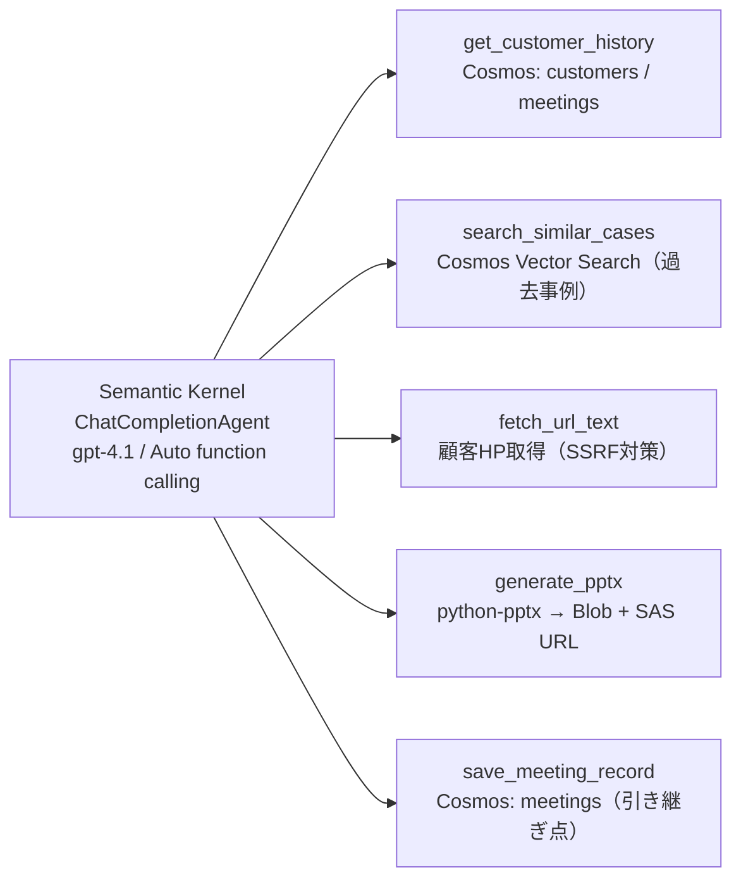

> ⚠️ これは提出用ドラフトです。公開前に以下を必ず差し替えてください。
> - `{{DEMO_VIDEO_URL}}`: 3分デモ動画（YouTube 等）— **埋め込み必須**
> - ✅ 成果物URL: 設定済み。アクセスコードで保護中。**コードは審査フォームの「審査員用ログイン情報」にのみ記載**し、この公開記事には書かないこと。
> - `{{GITHUB_URL}}`: GitHub リポジトリ（任意）
> - スクリーンショット、担当者名/チーム名

## 一言でいうと

**「営業担当者の面談準備（提案資料づくり）を、過去の面談データを引き継ぎながら自走して仕上げる AI エージェント」** です。
初回面談では類似事例を検索してアポ資料を生成し、2回目以降では前回の結果（outcomes）と宿題（nextActions）を踏まえて“一歩進めた”継続提案資料を自動生成します。

- 🎬 デモ動画: {{DEMO_VIDEO_URL}}
- 🌐 動作確認URL: https://ca-frontend.delightfulpebble-6aae50fe.eastus2.azurecontainerapps.io/ （アクセスコードで保護。コードは審査フォームに記載）
- 💻 GitHub（任意）: {{GITHUB_URL}}

## 解決したい業務課題（ビジネスインパクト）

営業の提案資料づくりは、**毎回ゼロから・属人的・時間がかかる**のが現場の実態です。とくに、

- 過去の類似案件の知見（提案書・カタログ）が個人のフォルダに埋もれ、再利用されない
- 「前回の面談で何が刺さって、次に何を出す約束だったか」が引き継がれず、継続提案が場当たり的になる

本エージェントは、**社内ナレッジ（過去資料）の検索**と**顧客ごとの面談履歴の蓄積・引き継ぎ**を自動化し、初回〜継続までの提案資料を数十秒で下書きします。担当者は「ゼロから作る」のではなく「レビューして仕上げる」だけになり、準備時間を大幅に短縮できます。

## 何ができるか

1. 顧客情報（会社名・業種・規模・課題感・取引相手の役職・公式HP）を入力
2. エージェントが自律的に：
   - 過去の取引履歴を確認（既存客なら前回の outcomes / nextActions を反映）
   - 公式HPを取得して事業特性を推定（任意）
   - 社内の過去資料をベクトル検索して類似事例を引用
   - 6スライド構成の提案資料（PowerPoint）を生成し、ダウンロードURLを発行
   - 面談レコードを保存（＝次回への引き継ぎ点）
3. 2回目以降は「前回面談メモ」を入れると、前回実績を確定したうえで継続提案を生成

進捗は SSE でリアルタイム表示（どのツールが走っているか可視化）されます。

## アーキテクチャ

### システム全体

### エージェント内部（Semantic Kernel + ツール群）

## 使用した Microsoft 技術

| 区分 | 採用技術 |
|---|---|
| アプリ実行基盤（必須） | **Azure Container Apps**（API・フロントを別アプリで稼働、scale-to-zero） |
| Microsoft AI 技術（必須） | **Azure OpenAI / Microsoft Foundry（gpt-4.1）** ＋ **Semantic Kernel** |
| データ × AI（RAG） | **Azure Cosmos DB の Vector Search**（過去資料の意味検索、1536次元） |
| 認証・ID | **Microsoft Entra ID**（フロントは Easy Auth、バックエンドは Managed Identity） |
| ストレージ | Azure Blob Storage（生成PPTXの保存・SAS配布） |
| レジストリ | Azure Container Registry |

## Agentic AI としてのアプローチ（アプローチの有効性）

単発のチャットではなく、**「履歴を引き継いで自走する」エージェント設計**が肝です。

- **5つのツール**を Semantic Kernel の Auto function calling でエージェント自身が選択・実行（履歴確認 → HP取得 → 事例検索 → 資料生成 → 履歴保存）。
- **初回と2回目以降を1エージェントで切り替え**：`meetingStatus` で instructions を出し分け、共通ツール群を再利用（過剰なサービス分割を避け、実装をシンプルに保つ）。
- **継続性の設計**：初回は `outcomes=null` で面談レコードを作って“引き継ぎ点”を残し、2回目以降は前回 outcomes / nextActions を必ず参照して提案を一段進めます。

## 実装上の工夫（完成度・実現性）

実務導入を見据え、「動く」だけでなく「壊れにくく・運用できる」ことに注力しました。

### 1. 前回実績の記録を“サーバ側で確定”（データ整合性）
継続提案の根拠になる「前回 outcomes」を、**LLM の呼び出し順に依存せず**サーバ側で前回 round を明示して確定記録。新しい面談レコードに誤って書き込まれて前回実績が消える事故を構造的に防いでいます。

### 2. ツール進捗のリアルタイム配信（SSE）
利用中の Semantic Kernel ではツール呼び出しが stream に流れないため、Function Invocation Filter でツール実行を捕捉し、`tool` / `tool_result` を **SSE で配信**。ユーザーは「いま何をしているか」を見られます。

### 3. 失効しないダウンロードURL
生成PPTXは時限SASで配布しますが、**永続データにはSASトークンを保存せず blob 名のみ**を記録し、履歴を読むたびに新しいSASを再発行。「保存済みURLが翌日401になる」問題を回避しています。

### 4. キー不要のクラウド認証（Managed Identity）
Cosmos / OpenAI / Blob へのアクセスを **Managed Identity** に統一（ローカルは .env キー、クラウドは MI に自動フォールバック）。**同一イメージ**がローカルとクラウドの両方でそのまま動きます。

### 5. セキュリティ・堅牢性
- 顧客HP取得は **SSRF対策**（内部IP/メタデータ遮断 + DNSリバインディング防止のIPピンニング）
- フロントは **Entra Easy Auth**、バックエンドAPIは **internal ingress（非公開）**
- 会社IDは会社名から決定的に導出（並行作成の衝突回避）、面談 round は409リトライで一意採番

### 6. プロンプトの工夫
- 役職（部長/課長…）を辞書で「経営層／部門責任者／担当者」に前処理し、刺さる論点へ誘導
- HP取得結果は `{ok:bool,...}` のJSONで返し、失敗時は本文として使わせない
- 表紙の年月はサーバが渡す「本日の日付」を基準にさせる（LLMの日付推測を防ぐ）

### 7. テスト・コスト
- ベクトル検索・PPTX生成・URL安全性などをカバーするユニットテスト（96件）
- Container Apps は **min-replicas=0（scale-to-zero）** でアイドル課金をほぼ停止

## デモ

{{DEMO_VIDEO_URL}}

（初回でアポ資料を生成 → 面談メモを入れて2回目の継続提案を生成、までを通しで紹介）

## 今後の展望

- 商品・価格スライドの実データ連携（現在はプレースホルダ）
- 面談実施後の議事録から outcomes を自動要約して記録
- CRM 連携によるトリガー起動

## まとめ

「過去の面談データを引き継ぐ」という一点に集中することで、営業の提案準備という地味だが重い業務を、Azure 上のエージェントで実用レベルに自動化しました。技術の新しさよりも **“実務をどれだけ動かせるか”** を意識して作っています。
